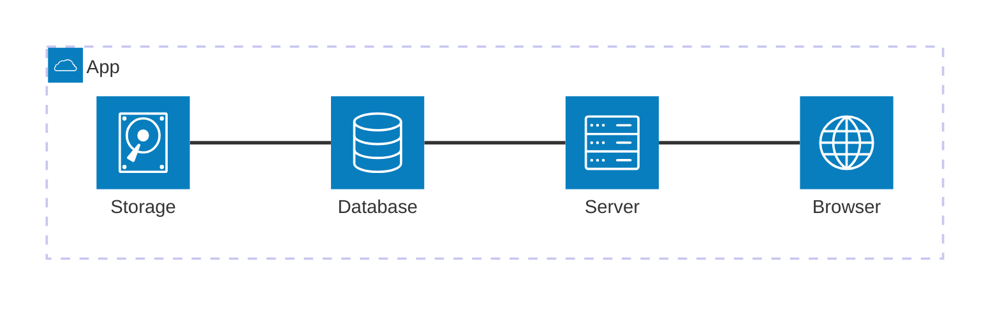
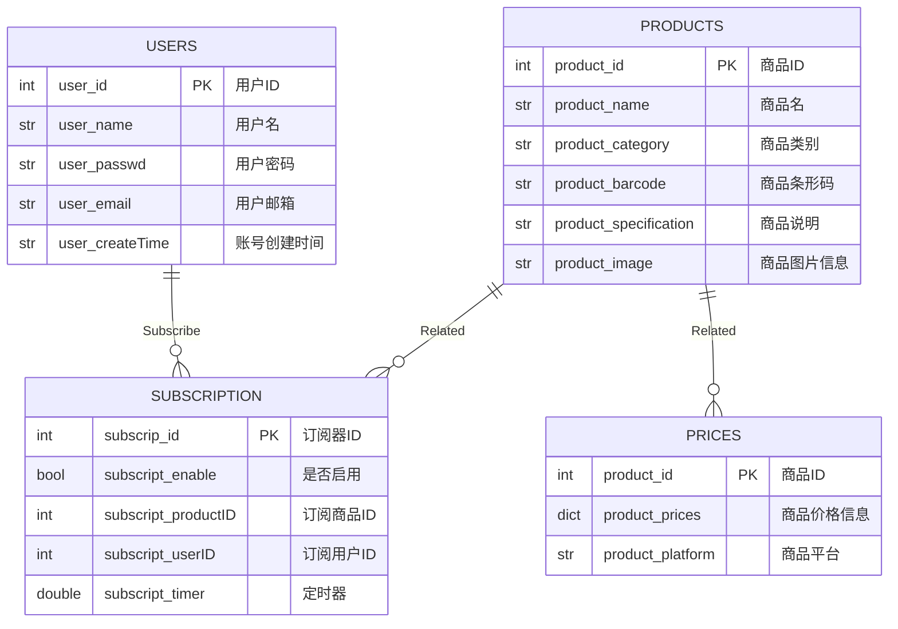

# 设计文档

## 1 总体信息

- 项目名称：商品比价网站
- 项目周期：2024-09-01 ~ 2025-01-01
- 项目仓库：[GitHub](https://github.com/lEEExp3rt/ZJU-BS-SYSTEM-PROJECT)
- 项目概述：任选Web开发技术实现一个商品价格比较网站，要求实现
    - 用户注册与登录
    - 商品查询与比较
    - 建立商品库
    - 降价提醒与消息推送
    - 适配手机样式
    - 界面友好
- 面向对象：使用商品网站的用户群体，课程组

## 2 需求分析

主要用户为经常使用网络购物方式进行商品网络购买和比较的群体

### 2.1 功能需求

- 对商品名称进行全面查询
- 跨电商平台的商品价格比较
- 商品的价格历史走势
- 商品的降价提醒
- ...

### 2.2 非功能需求

- 性能：查询性能优良，避免长时间等待
- 安全：实现用户注册与登录，信息安全保障、隐私设置
- 交互：用户界面友好，适配手机

## 3 规划设计

### 3.1 系统架构

### 3.2 技术栈

- 前端
    - HTML/CSS/JavaScript
    - 前端框架：Vue.js
    - 数据可视化框架：Chart.js
    - 移动端适配框架：Bootstrap
- 后端
    - 开发语言：Python
    - 开发框架：Flask
    - 数据库：MySQL
    - 爬虫框架：Scrapy
- 开发环境
    - 操作系统：WSL2 + Ubuntu-24.04
    - 包管理：Miniconda
    - 容器：Docker
    - 源代码管理：Git

### 3.3 模块设计

#### 3.3.1 主模块

- 主要功能
    - 菜单
        - 修改用户信息
        - 注销用户
    - 查询
        - 查询商品名称
        - 价格比较
    - 订阅
        - 是否开启订阅
        - 定时器功能

#### 3.3.2 用户模块

- 主要功能
    - 用户注册
        - 用户名
            - 6字节以上
            - 唯一性验证
        - 密码
            - 安全性分级
        - Email
            - 格式验证
    - 用户登录

#### 3.3.3 商品模块

- 主要功能
    - 存储商品信息
        - 商品名称
        - 商品价格
        - 商品品类
        - 商品规格
        - 商品条码
        - 商品图片
    - 爬虫
        - 电商平台信息爬取
        - 本地存储

#### 3.3.4 查询模块

- 主要功能
    - 分词处理
    - 多个查询结果处理

#### 3.3.5 可视化模块

- 主要功能
    - 商品信息显示
    - 价格走势可视化

#### 3.3.6 降价提醒模块

- 主要功能
    - 订阅功能
    - 定时功能
    - 订阅推送

#### 3.3.7 爬虫模块

- 主要功能
    - 登录电商平台
    - 信息爬取
    - 本地存储

### 3.4 数据库设计

#### 3.4.1 用户表 `users`

| 属性名 | 数据类型 | 备注 |
| :--: | :--: | :--: |
| `user_id` | `int` | 用户ID，主键 |
| `user_name` | `str` | 用户名 |
| `user_passwd` | `str` | 用户密码，哈希值存储 |
| `user_email` | `str` | 用户邮箱 |
| `user_createTime` | `str` | 账号创建时间 |

#### 3.4.2 商品信息表 `products`

| 属性名 | 数据类型 | 备注 |
| :--: | :--: | :--: |
| `product_id` | `int` | 商品ID，主键 |
| `product_name` | `str` | 商品名 |
| `product_category` | `str` | 商品类别 |
| `product_barcode` | `str` | 商品条形码 |
| `product_specification` | `str` | 商品说明 |
| `product_image` | `str` | 商品图片信息，URL |

#### 3.4.3 商品价格表 `prices`

| 属性名 | 数据类型 | 备注 |
| :--: | :--: | :--: |
| `product_id` | `int` | 商品ID，主键 |
| `product_prices` | `dict` | 商品价格信息，<时间：价格> |
| `product_platform` | `str` | 商品平台 |

#### 3.4.4 降价订阅表 `subscription`

| 属性名 | 数据类型 | 备注 |
| :--: | :--: | :--: |
| `subscrip_id` | `int` | 订阅器ID，主键 |
| `subscript_enable` | `bool` | 是否启用 |
| `subscript_productID` | `int` | 订阅商品ID |
| `subscript_userID` | `int` | 订阅用户ID |
| `subscript_timer` | `double` | 定时器 |

#### 3.4.4 E-R 图

### 3.5 系统流程

1. 用户注册或登录，系统验证用户信息
2. 用户输入商品名称，系统进行分词处理，调用电商平台的API或爬虫
3. 系统获取商品价格并存入数据库，展示给用户
4. 用户可查看商品历史价格走势图
5. 用户设置降价提醒，系统会定时检查商品价格变化并通知用户

## 4 开发计划

1. 启动
   1. 确定技术栈
   2. 总体设计
   3. 资料查阅
2. 开发
   1. 后端
      1. 数据库设计
      2. 后端框架搭建
      3. 爬虫框架搭建
      4. 总体建设
   2. 前端
      1. 框架搭建
      2. 调整
   3. 整合
3. 测试
      1. 后端正确性
      2. 前端样式
4. 交付
   1. 容器打包
   2. 发布Release
   3. 上传

## 5 维护和支持

项目维护持续进行中
