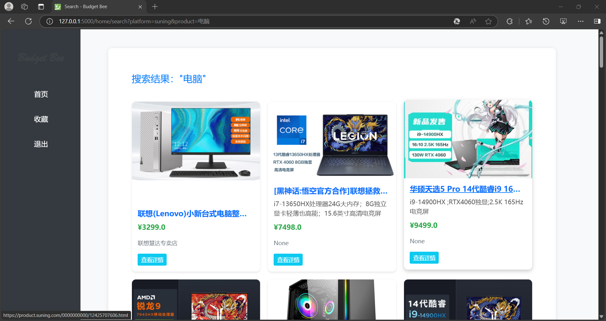
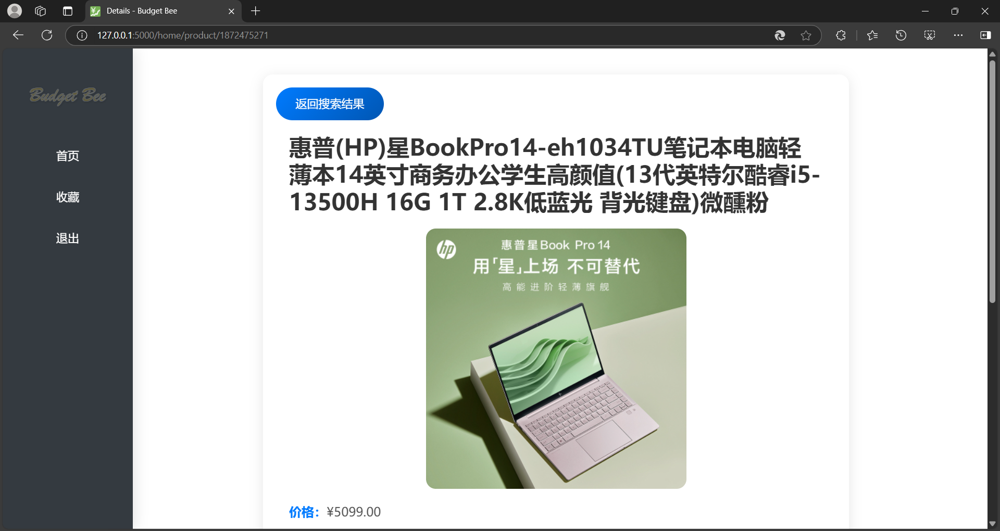
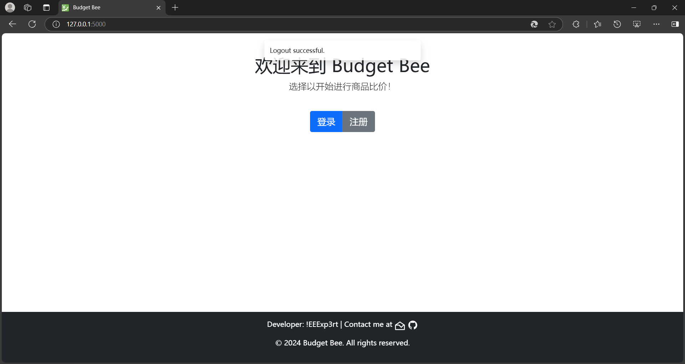

# 开发报告

## 1 开发过程

### 1.1 引言

这是目前为止接触到的一个比较大的项目，在这个项目之前，我还不会前后端的技术，唯一的基础可能是2023-2024春夏学期的数据库系统这一门课的春季大程：图书管理系统

图书管理系统给了我开发这个项目的很多启发

在设计之初其实我是非常想使用java+springboot作为后端框架入手的，因为spring比较完善且主流，适合这个项目的开发

原来我是打算在国庆期间就把它做完，结果国庆正是其它专业课开始狂轰滥炸的起点，所以就一直拖着没做，直到提交中期设计报告

基于项目截止日期迫近，只能被迫放弃java，改用上手快且简单的Flask，设计报告就基于这个后端框架基础开始进行

### 1.2 开发

最后开始开发的日期应该是12月20日，此时留给我的时间不多了，这时候我刚刚完成其它所有课的小lab，可以着手全力攻这个项目

根据之前学长们的经验，大概需要爆肝一周左右，于是正式开始我的开发之旅

基本上开发进度是随着日期往后而加快的，每一天都会有一些提交，但是总体来说提交的高峰是在年末三天左右

开发最开始几天进度甚微，因为需要参阅大量的文档和资料，比如寻找Flask的教程进行快速上手

找来找去最后还是找到了Flask的官方文档，于是参照着官方文档进行开发

大概花了五天左右的开发，在开发过程中我逐渐理解了Flask这个框架的逻辑，于是后面实现起来就相对快很多

### 1.2.1 数据库模块

这个模块是最开始做的，因为毕竟全栈项目，离不开数据库的交互，所以先基于图书管理系统的项目经验构建了一个数据库模块

我个人非常推崇规范的代码组织和开发模式，非常注重面向对象的开发，所以我的目标是把所有和数据库操作相关的内容全部放在这个模块内，最好是能封装成一个完整的类进行使用

但是你参阅我的提交历史，你会发现光是数据库模块的改动就有五六次，因为直到最后一次大改动之前，数据库模块其实都是一个不能完全封装的状态，这令我非常的苦恼和难受

理论上说，可以直接封装成数据库的`DatabaseManager`类，但是为了契合Flask应用的逻辑，不得不把很多东西拆开，导致数据库模块就是一个**半封装**的状态，后续的很多操作其实还是需要引入原始的导入`pymysql`库进行操作

不过，好在在开发的过程中我理解了Flask框架的逻辑，最后能够把数据库模块封装好，后面只需要直接调用这个模块就可以与数据库进行交互了

### 1.2.2 数据模型

这个步骤不难，根据创建的数据库表定义python的类，使得每一个数据表在我的项目中都有一个类能够直接对应，每个类都封装好了对应的方法，直接进行调用即可

项目初期设计的这个模型还是比较牢靠的，基本上4个类都没有大改，只出现一些为了适配需要而进行的小功能的添加和改动

### 1.2.3 爬虫服务

这个项目的核心应该就是爬虫了，之前就了解过爬虫爬取电商平台就有一些限制，可能会出现问题，而且之前也不会爬虫，所以这里也经过很多时间的开发，不过总体还是比较顺利的

查阅了一些资料后决定使用selenium进行，放弃了设计报告中的scrapy框架

selenium技术其实就是自动化操作，自动化打开浏览器，输入关键字，然后抓取页面信息，返回给后台进行处理

最容易上手的平台是苏宁和当当，这两个平台不需要绕过验证的操作，直接登录就可以抓取，所以从这里开始

这里的爬虫就需要根据浏览器的开发人员工具进行抓取，找到每个商品的信息对应的HTML元素，然后读取，套路是一致的，所以完成了苏宁之后当当就很快完成了，也经过了测试

在项目末期我重新对这个模块进行修改，使得它也成为一个封装好的类，这样在主模块中就可以直接调用

### 1.2.4 邮件系统

用户注册需要邮件验证码，后续的降价订阅也需要，所以实现一个邮件管理系统，也是直接封装成类的

这里主要直接调用python的email和smtplib的库进行操作

为了这个项目我还专门去注册了一个163邮箱，用这个邮箱作为我的项目的官方邮箱

### 1.2.5 视图

视图这里就是主要内容了，Flask中的视图是和前端页面直接进行交互的，也是直接实现功能的地方

参照了Flask的官方文档，写完登录注册的界面，就已经接近末期了

最后三天也是爆肝，把所有视图都写完了，非常不容易

> 用户订阅这个功能没有实现，时间来不及了

### 1.2.6 前端

最开始打算使用Vue.js作为前端，项目采取前后端分离的方式实现，但是实际上到最后几天我甚至还没做完后端，前端就更不用说了，也更不用说还没学过的Vue.js

最后直接采用比较简单的Bootstrap框架，它刚好适配移动端，组件简单，所以直接转投

在新年到来之前我只做到了登录注册、用户输入关键词进行爬虫搜索并展示这一步，爬虫的数据甚至都没有存到数据库，也更不用说历史价格走势等

但是经过一晚上的爆肝（做到五点半）终于完成了这些功能，并且调用了Chart.js进行历史价格走势图的渲染

### 1.2.7 未完成的功能

最后就差一个用户订阅的功能了，这里实在来不及做了

因为商品的信息和历史价格的信息都已经存在本地，所以这里只需要

1. 创建一个视图用于查看用户的关注列表，进入这个视图后就查看用户id对应的订阅表中的所有商品的id，再去商品表把商品信息调出来
2. 每个商品卡片添加一个“关注”按钮，点击之后调用数据库模块，添加一条记录到`subscription`表
3. 每次爬虫爬取数据的时候就抓取对应的已关注商品的信息，然后查看价格，如果价格有变动就发送提醒

逻辑如上，实现起来应该不难

其它的一些小功能肯定有完善的地方，比如前端界面再友好一点等等，也算在这里

## 2 项目测试

### 2.1 开始运行

### 2.2 首页

开始运行后，进入浏览器，输入`127.0.0.1:5000`登录网站

底部有开发者信息

### 2.3 注册

进入注册界面，填写好用户名、密码、确认密码、邮箱后，点击获取验证码，可以看到系统提示验证码已发送

查看邮箱，发现验证码信息

点击注册

由于我之前已经用这个邮箱注册过，所以显示邮箱已注册，无法注册当前账号

如果有字段为空，则前端直接提示需要填写对应字段，否则无法注册

### 2.4 登录

在登录界面输入用户名和密码进行登录

系统会弹窗显示用户已登录

登录后所在界面就是主界面，左边是侧边栏，用于导航，可以选择退出、回到首页、进入收藏夹，右边是主界面，包含了欢迎信息，站点介绍和搜索框，底部有站点的log1，左上角有闪烁的站点logo2，浏览器标签页有站点logo3

### 2.5 搜索

在搜索框输入想要搜索的商品，左边选择平台，点击搜索

点击搜索后，浏览器标签页会有转圈圈，表示当前正在进行页面加载

加载完成后会出现商品列表，每一个商品都是一张卡片，包含了图片、名称、商品描述、价格、查看详情

鼠标放置在商品卡片上会有卡片浮动效果，并且点击商品名称可以跳转到商品的原链接

顶部的搜索框是浮动样式，当鼠标滚轮向下滑动或鼠标向下移动会收起顶部的搜索框，当向上滚动回到页面顶部或鼠标移动到屏幕上方时会重新唤出搜索框

移动端适配上，商品卡片会自动根据屏幕大小作响应式布局，以适应屏幕尺寸

### 2.6 商品详情

点击查看详情后，会进入商品详细信息页，顶部有一个返回搜索结果，点击即可返回原来的搜索界面，之后是商品的名称、图片、价格等信息

往下拉可以看商品的历史价格走势图，鼠标放置可以看每个监测点的具体信息

### 2.7 退出登录

点击侧边栏的退出后即可退出登录，页面顶部会出现弹窗表示用户已退出登录

## 3 开发心得

总体来说，这个项目还是非常庞大的，开发的过程也是非常的辛苦，对于全栈小白来说还是很有挑战的，需要在很短的时间内实现这么多的功能个人认为也是一件不容易的事

不过，相比如算法和理论，这种项目的实践并不能说有很大的难度，主要需要完全投入去爆肝

经过这个项目的实践，我对前后端有更深的了解了，也算是有了项目实践经历，这个过程还是蛮有趣的，特别是最后看自己做出来的这个成品，居然，诶呦喂，您猜怎么着，还倍儿有点样子

不过，这仅仅是很基础的一个小站点，相比之下那些大型的项目甚至是公司的商业产品，才真的难搞

总的来说，从建立仓库、设计报告、开始动工一路到完结，还是非常有趣的，只可惜开始太晚，未能实现所有的功能，还有很多地方也可以去完善

## 4 更多

这个项目可能会继续完善
